`	`****

**Project 1** 

**OLAP**

**Structured Database**

**Team 05**

**Members**

**Fredin Alberto Vázquez Martínez**

**Aleksei Ithan Garcia Diaz**

**Requirements sheet:**

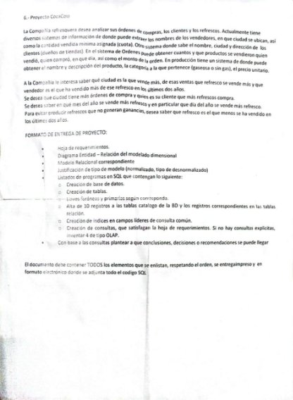

**Multidimensional Diagram (Star diagram):**

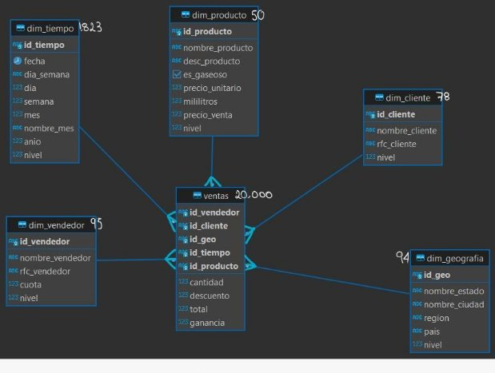

**Why Choose the Star Model?**

Upon analyzing the business, it becomes evident that our client, despite having numerous sales, offers a limited product range, typically comprising fewer than 30 items. This strategic approach prompts the adoption of a star model. While this may result in some data redundancy, it facilitates quicker query processing.

In our `dim_geography` table, each state is associated with three cities, structured across five hierarchical levels:

- Level 1: Full registration
- Level 2: Region
- Level 3: Country
- Level 4: Status
- Level 5: City

The `dim_customer` and `dim_vendors` tables, dedicated to customer and vendor information respectively, have a single-level structure.

Within the product dimension (`dim_product`), we organize information across four dimensions:

- Level 1: Full registration
- Level 2: Milliliters
- Level 3: Price
- Level 4: Product name

The `dim_tiempol` table, containing extensive time-related data, spans six levels:

- Level 1: Full registration
- Level 2: Name of the day
- Level 3: Number of the day month
- Level 4: Name of the month
- Level 5: Year
- Level 6: Number of months

As for the `dim_vendors` table, it features two levels:

- Level 1: Full registration
- Level 2: Vendor quota

**Creation of the database:**

**Creation of indexes**

Indexes used to avoid the search to be executed in the whole column, instead it will be executed only in one column, that is why it should be placed in common query leader fields and not in all the attributes. So the common query ones were placed.

It is reminded that for UNIQUE and PK their indexes are automatically generated.

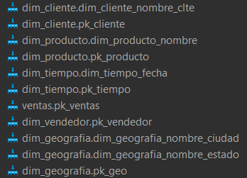

**Code**

**Insertion of records**

The insertion of records was all done from csv.

dim\_customer

dim\_geography

dim\_product

dim\_time

dim\_vendors

sales

Consultation procedure

Query 1 : 

"For the last two years, obtain the city with the highest sales. From that city, identify the soft drink that sells the most, and from the top-selling soft drink, find the vendor with the highest sales of that particular soft drink."

Qlik sense

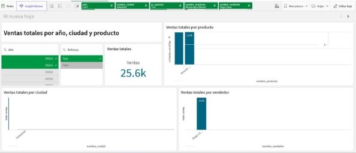

Query 2 

"We want to know which city has the most purchase orders and who its customer is that buys the most soft drinks."

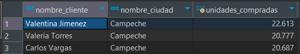

Qlik sense

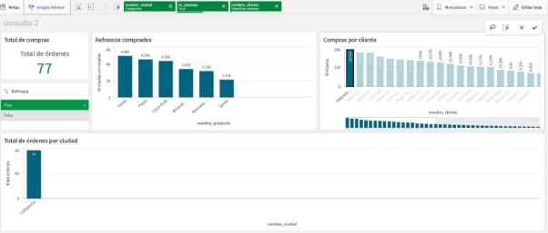

Query 3 

"We want to know in which month of the year the most soda is sold and specifically which day of the year the most soda is sold."

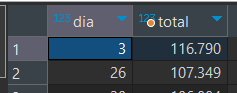

Qlik sense

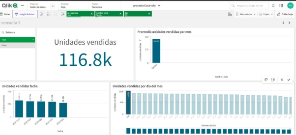

Consultation 4 

"We want to know which soft drink has the least sales in the last 2 years."

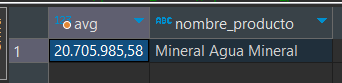

Qlik sense

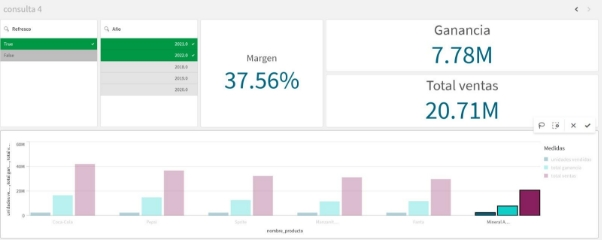

### RapidMiner 

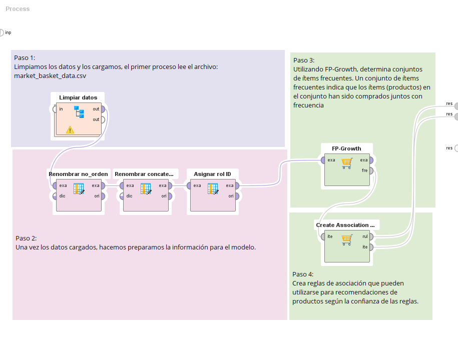

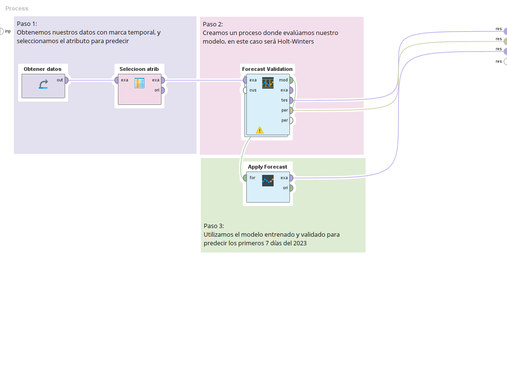

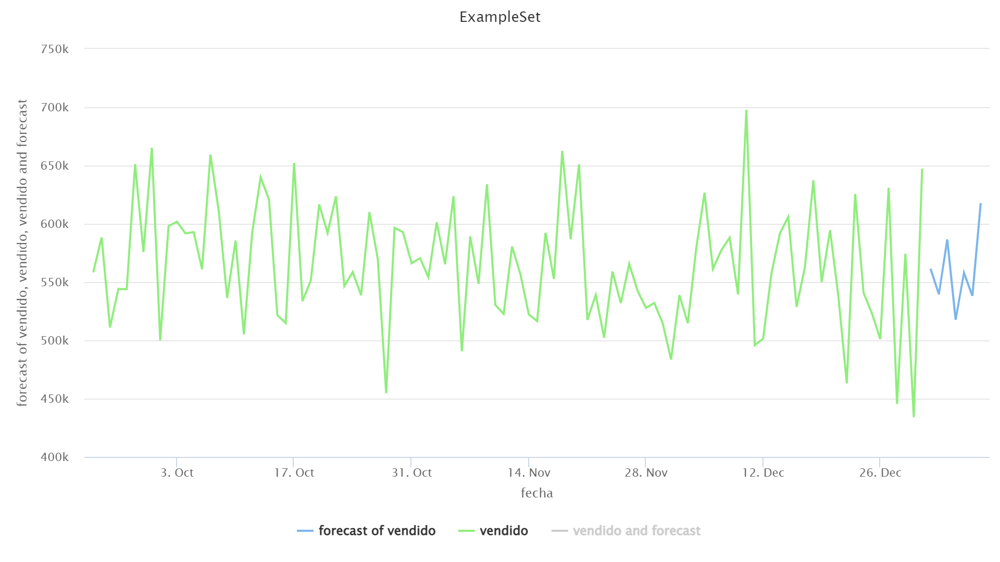

