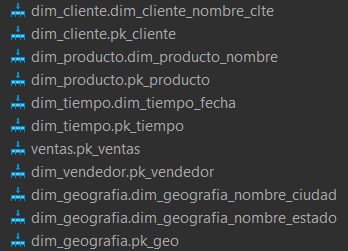
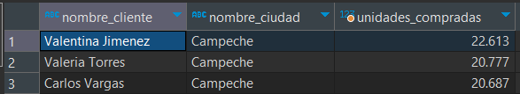
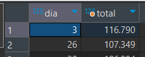
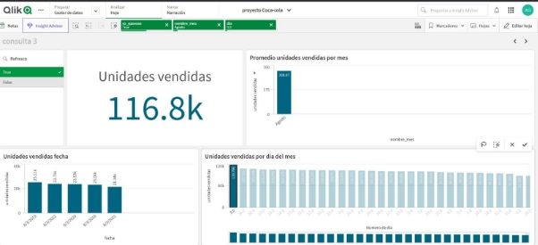
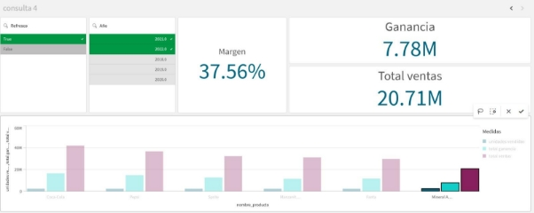

`	`****

**Project 1** 

**Invoices**

**Structured Database**

**Equipment 05**

**Members**

**Fredin Alberto Vázquez Martínez**

**Aleksei Ithan Garcia Diaz**

**Requirements sheet:**

**Multidimensional Diagram (Star diagram):**

**Why star model?**

When analyzing the business we can realize that our client does not have many products, they have many sales but the amount of products that may have does not exceed 30 products, this by the business strategy that is taking, this allows us to choose for a star model, although there will be repetition of information will allow us to work with queries more quickly.

In our dim\_geography table for each state we have 3 cities.

We have 5 levels within the dim\_geography table:

- Level 1: Full registration 
- Level 2: Region
- Level 3: Country
- Level 4: Status
- Level 5: City

For our dim\_customer table we have only the information of the customers, so it has only one level, the same happens with the dim\_vendors table.

For our product dimension we have 4 dimensions

- Level 1: Full registration 
- Level 2: Milliliters 
- Level 3: Price 
- Level 4: Product name 

The information in the dim\_tiempol table is extensive, since it has each day of the year, and its information, the levels are as follows 

- Level 1: Full registration 
- Level 2: Name of the day 
- Level 3: Number of the day month
- Level 4: Name month
- Level 5: Year
- Level 6: Number of months

For the dim\_vendors table there are 2 levels:

- Level 1: Full registration
- Level 2: Vendor quota

**Creation of the database:**

**Creation of indexes**

Indexes used to avoid the search to be executed in the whole column, instead it will be executed only in one column, that is why it should be placed in common query leader fields and not in all the attributes. So the common query ones were placed.

It is reminded that for UNIQUE and PK their indexes are automatically generated.

**Code**

**Insertion of records**

The insertion of records was all done from csv.

dim\_customer

dim\_geography

dim\_product

dim\_time

dim\_vendors

sales

Consultation procedure

Query 1 : 

"For the last two years, obtain the city with the highest sales. From that city, identify the soft drink that sells the most, and from the top-selling soft drink, find the vendor with the highest sales of that particular soft drink."

Qlik sense

Query 2 

"We want to know which city has the most purchase orders and who its customer is that buys the most soft drinks."

Qlik sense

Query 3 

"We want to know in which month of the year the most soda is sold and specifically which day of the year the most soda is sold."

Qlik sense

Consultation 4 

"We want to know which soft drink has the least sales in the last 2 years."

Qlik sense

